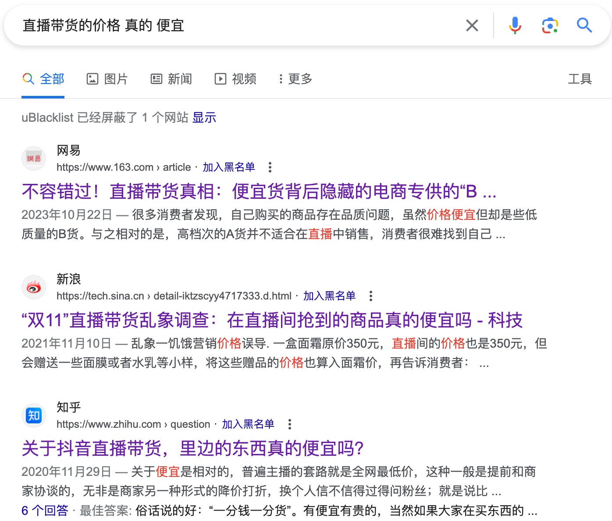

# 主播家人鉴定器
直播间的甜言蜜语让人失去理智，开源社区应该对其进行整治，需要开源社区为此集思广益、添砖加瓦。

有正义的程序员会为此感到愤慨。

抖音部分东西实际比淘宝都贵，你真的感觉到抖音的便宜了吗？

国内需要一个展示直播间价格与其他购物平台价格对比的网站，从而让直播带货真正做到为“家人们”考虑。

# 起因

突然就意识到，现存有一个关于网络直播带货的问题一直没有解决，直播一定要带货吗？主播带的货真的便宜吗？他们真的把你当家人了吗？

上网调查了一番，证明了这种事情出现了很多年。




# 分析

我们可以这么分析，如果直播带的货比其他平台的还要便宜，那么说明这个货真的不值这么多钱，因为主播带货的话，主播不要工资吗？直播中控不要工资吗？羊毛出在羊身上，所以成本一定很低。

如果比其他平台的贵，那么为什么不去其他平台购买呢？为什么就要在这个地方购买？是这个主播会哄人还是他有才华？单纯会哄人的话，那大可不必在她这买，她哄人，她挣口饭吃。

线下购物还知道货比三家，听人一blabla，结果都忘了。

# 调查

他如果有才华，冲着才华来的，为信仰充值，那也无可厚非。比方说东方甄选的，他们直播间的内容似乎都是独家的，他们也有自己的旗舰店，我找了几个没找到和他家商品一样的但店铺不是他家的。

有便宜的吗？有的，我随机找了一些，其中比淘宝便宜的还真有，但十分少，大部分旗舰店直播间与其他平台价格相差无几，毕竟要齐头并进，不能舍弃一边，相反，一些小众的，就很容易有更便宜的商家出售。


# 需求

所以，需求如下：获取用户所看直播间中的小黄车的所有商品信息，包含商品名称和详细信息，名称是为了找商品，详细信息是为了比对找到的商品的相似度。

其他平台包含“淘宝、京东、拼多多”

初级形态可以做成油猴插件的形式，先试试可行度。

然后逐步扩展，比如发布APP并且可以展示在这些直播平台的前面，推出实时监控信息从而发布到网站，借助这些平台的用户量来扩展用户，查看广告可以获得半小时时长，提供更加优惠的优惠券。

从而在一定程度上，整顿直播行业，**但难度很大**，因为这是很多公司赖以生存的途径。

```java
// ==UserScript==
// @name         抖音直播间商品信息提取器
// @namespace    http://tampermonkey.net/
// @version      0.1
// @description  自动提取抖音直播间商品的价格和标题信息,下一步是进行淘宝价格的返回
// @author       familyouknow
// @match        https://live.douyin.com/*
// @grant        none
// ==/UserScript==

(function() {
    'use strict';

    window.onload = function() {
        // 功能函数：点击指定元素
        function clickElement(selector) {
            const element = document.querySelector(selector);
            if (element) {
                element.click();
                console.log('元素已点击');
            } else {
                console.warn('未找到指定的元素！');
            }
        }

        // 功能函数：提取并清理商品标题
        function cleanTitle(rawTitle) {
            // 提取直播间信息
            const liveRoomInfoElement = document.querySelector("#island_edf16 > div > div.BpZffg7x > div > div > a");
            const liveRoomInfo = liveRoomInfoElement ? liveRoomInfoElement.innerText : '';

            // 定义需要移除的词汇或表达式
            const removePatterns = [
                new RegExp(liveRoomInfo, 'g'), // 动态移除直播间信息
                // 可以根据需要添加更多的模式
            ];

            // 应用所有模式
            removePatterns.forEach(pattern => {
                rawTitle = rawTitle.replace(pattern, '');
            });

            return rawTitle.trim(); // 清除字符串两端的空白
        }

        // 功能函数：提取商品信息
        function extractProductInfo() {
            let products = document.querySelectorAll('.PGA7qLAy li');
            if (products.length === 0) {
                console.warn('未找到商品信息！');
                return;
            }
            products.forEach((product, index) => {
                let priceElement = product.querySelector('.DrH83f6g .CRfczKkD');
                let titleElement = product.querySelector('span[data-e2e="promotion-title"]');
                let price = priceElement ? priceElement.innerText : '价格未找到';
                let rawTitle = titleElement ? titleElement.innerText : '标题未找到';
                let title = cleanTitle(rawTitle); // 清理标题
                console.log(`商品${index + 1}的标题：${title}, 价格：${price}`);
            });
        }

        // 点击指定元素以显示商品列表
        clickElement("#_douyin_live_scroll_container_ > div > div > div > div > div._uuQkdQj > div > div.xrnYRWXb > div > div.YWlxyPHa > div > div > div:nth-child(2) > div > div > span");

        // 延时后提取商品信息
        setTimeout(extractProductInfo, 3000); // 可根据需要调整延时时长

        // 监听DOM元素变化
        let observer = new MutationObserver(mutations => {
            mutations.forEach(mutation => {
                if (mutation.type === 'childList') {
                    extractProductInfo();
                }
            });
        });

        // 配置观察器选项:
        let config = { childList: true, subtree: true };

        // 选择需要观察变动的节点
        let targetNode = document.querySelector('.PGA7qLAy');
        if (targetNode) {
            observer.observe(targetNode, config);
        } else {
            console.warn('未找到目标节点！');
        }
    };
})();
```


# 已知信息

抖音直播间链接不变
